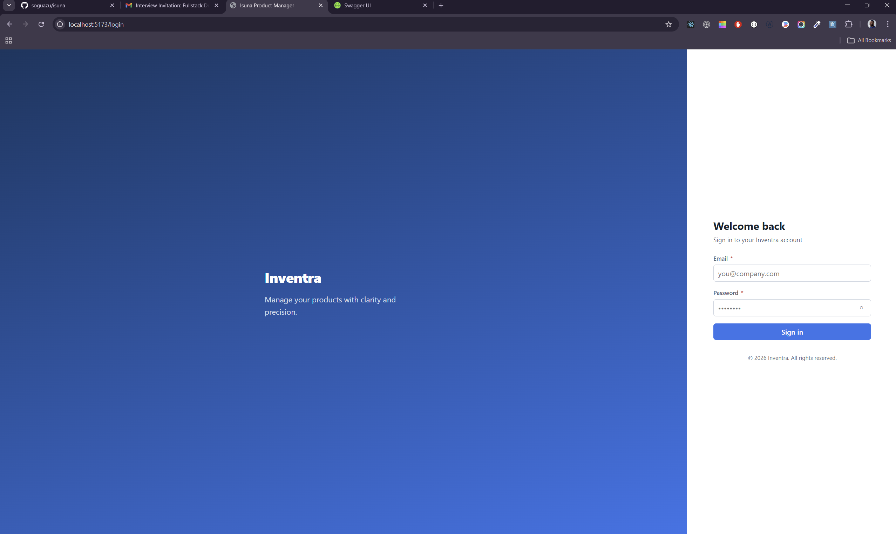
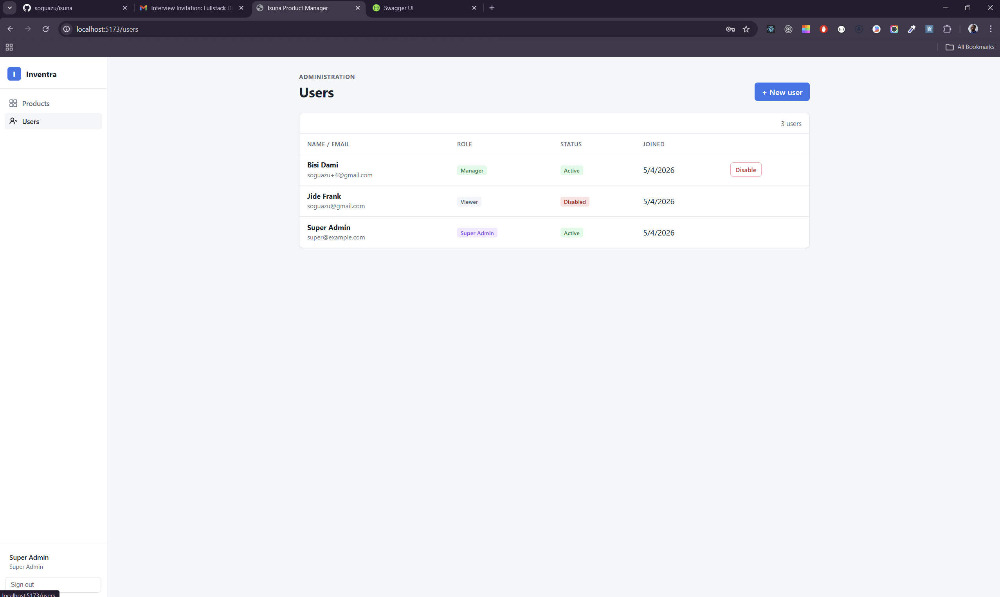
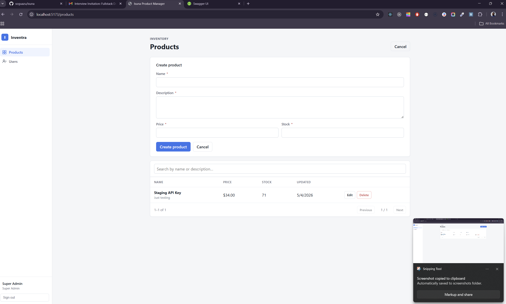
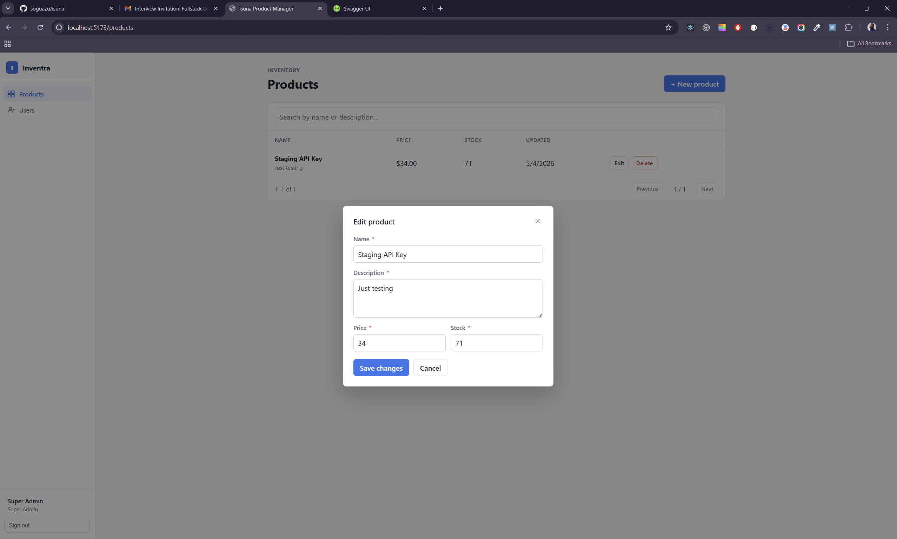
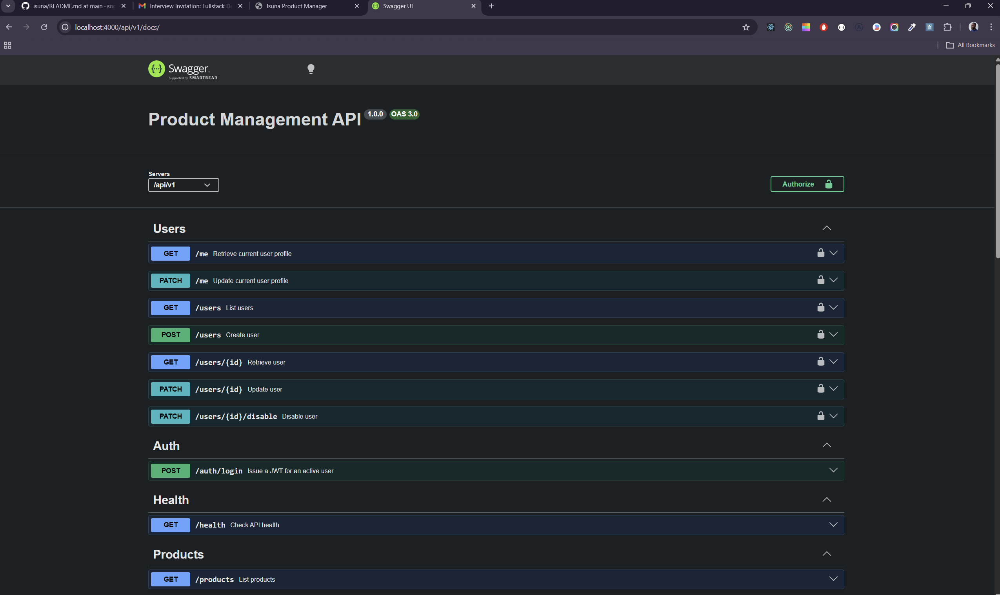

# Isuna

A full-stack product management system with role-based and attribute-based access control (RBAC + ABAC).

**Backend:** Express · TypeScript · Sequelize · SQLite · JWT  
**Frontend:** React 19 · Vite · TypeScript  
**API Docs:** OpenAPI 3.0 via Swagger UI

---

## Table of Contents

- [Screenshots](#screenshots)
- [Architecture](#architecture)
- [Setup](#setup)
  - [Prerequisites](#prerequisites)
  - [Docker (recommended)](#docker-recommended)
  - [Local (bare-metal)](#local-bare-metal)
- [Environment Variables](#environment-variables)
- [Available Scripts](#available-scripts)
- [API Usage Examples](#api-usage-examples)
  - [Authentication](#authentication)
  - [Products](#products)
  - [Users](#users)
- [Access Control](#access-control)
  - [Roles](#roles)
  - [Permission Matrix](#permission-matrix)
  - [ABAC Profile Rules](#abac-profile-rules)

---

## Screenshots

### Login



*Sign in page for the Inventra product manager.*

### Users



*User administration with active/disabled status, role badges, and account management actions.*

### Products — Create



*Create a new product from the inventory dashboard.*

### Products — Edit



*Edit an existing product in a modal dialog.*

### Products — List


*Inventory list page with search, pagination, and product actions.*

### Swagger API Docs



*Auto-generated OpenAPI docs at `http://localhost:4000/api/v1/docs/`.*


*`POST /auth/login` — exchange credentials for a JWT and paste it into the Authorize dialog to test protected endpoints directly from the browser.*

---

## Architecture

```
isuna/
├── backend/                  # Express REST API
│   └── src/
│       ├── app.ts            # Express app factory
│       ├── server.ts         # HTTP entry point
│       ├── config/           # Env var loading + validation
│       ├── container/        # Dependency injection composition root
│       ├── common/
│       │   ├── errors/       # Structured ApiError class
│       │   ├── middlewares/  # async-handler, error, rate-limit, validate-request
│       │   └── types/        # Express augmentation (req.user)
│       ├── infra/
│       │   ├── database/     # Sequelize factory + DatabaseContext
│       │   └── swagger/      # OpenAPI 3.0 spec
│       ├── migrations/       # Sequelize migration files
│       ├── seeds/            # Super admin seeder
│       └── modules/
│           ├── auth/         # JWT service, login handler, authenticate + authorize middleware
│           ├── health/       # Health check endpoint
│           ├── products/     # Product CRUD (controller → service → repository)
│           └── users/        # User management (controller → service → repository)
└── frontend/                 # React SPA
    └── src/
        └── App.tsx           # Product list, create form, delete
```

### Key Design Decisions

| Concern | Approach |
|---|---|
| Auth | Custom HS256 JWT via Node.js `crypto` — no third-party JWT library |
| Passwords | `crypto.scryptSync` with random per-user salt; `timingSafeEqual` for comparison |
| Authorization | RBAC enforced at route layer; ABAC profile rules enforced at service layer |
| Database | SQLite via Sequelize with `paranoid: true` — all deletes are soft deletes |
| Validation | Zod schemas on every request; errors returned as structured JSON |
| Caching | 30-second in-memory TTL cache on product list and retrieve; invalidated on writes |
| Rate limiting | Custom in-memory implementation (per-IP, configurable window and max) |
| API versioning | All routes under `/api/v1` |
| Tests | Vitest + Supertest against an in-memory SQLite instance |

---

## Setup

### Prerequisites

- **Docker** (recommended path) — Docker Engine 24+ and Docker Compose v2
- **Node.js 20+** (bare-metal path)

### Docker (recommended)

```bash
# 1. Clone and enter the repository
git clone <repo-url>
cd isuna

# 2. Create the backend environment file
cp backend/.env.example backend/.env
# Edit backend/.env and set JWT_SECRET, SUPER_ADMIN_EMAIL, SUPER_ADMIN_PASSWORD

# 3. Build and start both services
docker compose up --build
```

| Service | URL |
|---|---|
| Frontend | http://localhost:5173 |
| API | http://localhost:4000/api/v1 |
| Swagger UI | http://localhost:4000/api/v1/docs/ |

On first start the backend container automatically runs database migrations and seeds the super admin account before serving traffic. The SQLite database file is persisted in the `backend-data` named Docker volume.

To stop:

```bash
docker compose down
# To also remove the database volume:
docker compose down -v
```

### Local (bare-metal)

**Backend**

```bash
cd backend
cp .env.example .env
# Edit .env — set JWT_SECRET, SUPER_ADMIN_EMAIL, SUPER_ADMIN_PASSWORD at minimum

npm install
npm run db:migrate       # Create database tables
npm run db:seed:dev      # Seed the super admin account
npm run dev              # Start dev server with hot reload
```

API base: `http://localhost:4000/api/v1`  
Swagger UI: `http://localhost:4000/api/v1/docs/`

**Frontend** (separate terminal)

```bash
cd frontend
npm install
npm run dev
```

UI: `http://localhost:5173`

---

## Environment Variables

Copy `backend/.env.example` to `backend/.env` and set these values:

| Variable | Default | Required in production | Description |
|---|---|---|---|
| `NODE_ENV` | `development` | yes | `development`, `test`, or `production` |
| `PORT` | `4000` | no | HTTP listen port |
| `DATABASE_PATH` | `./data/database.sqlite` | no | SQLite file path; use `:memory:` for tests |
| `JWT_SECRET` | *(dev fallback only)* | **yes** | Long random secret — must be set in production |
| `JWT_EXPIRES_IN_SECONDS` | `3600` | no | Token lifetime in seconds |
| `RATE_LIMIT_WINDOW_MS` | `60000` | no | Rate limit window in milliseconds |
| `RATE_LIMIT_MAX_REQUESTS` | `100` | no | Max requests per window per IP |
| `SUPER_ADMIN_NAME` | `Super Admin` | no | Display name for the seeded admin account |
| `SUPER_ADMIN_EMAIL` | `super@example.com` | yes (for seeding) | Login email for the seeded super admin |
| `SUPER_ADMIN_PASSWORD` | `change-this-password` | yes (for seeding) | Login password for the seeded super admin |

The frontend reads one build-time variable:

| Variable | Default | Description |
|---|---|---|
| `VITE_API_BASE_URL` | `http://localhost:4000/api/v1` | Backend API base URL baked into the bundle |

---

## Available Scripts

### Backend

```bash
npm run dev            # Dev server with hot reload (tsx watch)
npm run build          # Compile TypeScript + rewrite path aliases
npm start              # Run compiled dist/ in production
npm run db:migrate     # Apply Sequelize migrations
npm run db:migrate:undo  # Roll back the last migration
npm run db:seed:dev    # Seed super admin (TypeScript dev mode)
npm run db:seed        # Seed super admin (compiled JS, used in Docker)
npm run lint           # Run ESLint
npm test               # Run Vitest (single pass)
npm run test:watch     # Run Vitest in watch mode
```

### Frontend

```bash
npm run dev       # Vite dev server on port 5173
npm run build     # Type-check + Vite production build
npm run preview   # Serve production build locally (used in Docker)
```

---

## API Usage Examples

All examples use `curl`. Replace `TOKEN` with the JWT returned from the login endpoint.

### Authentication

**Login**

```bash
curl -s -X POST http://localhost:4000/api/v1/auth/login \
  -H "Content-Type: application/json" \
  -d '{"email": "super@example.com", "password": "change-this-password"}'
```

```json
{
  "token": "eyJ...",
  "expiresIn": 3600,
  "user": {
    "id": "a1b2c3d4-...",
    "name": "Super Admin",
    "email": "super@example.com",
    "role": "super_admin",
    "isActive": true,
    "createdAt": "2026-05-04T10:00:00.000Z",
    "updatedAt": "2026-05-04T10:00:00.000Z"
  }
}
```

---

### Products

**List products** (public, paginated, searchable)

```bash
curl http://localhost:4000/api/v1/products?page=1&pageSize=5&search=widget
```

```json
{
  "data": [
    {
      "id": "...",
      "name": "Blue Widget",
      "description": "A sturdy blue widget.",
      "price": "9.99",
      "stockQuantity": 42,
      "createdAt": "...",
      "updatedAt": "..."
    }
  ],
  "meta": {
    "total": 1,
    "page": 1,
    "pageSize": 5,
    "totalPages": 1
  }
}
```

**Get one product** (public)

```bash
curl http://localhost:4000/api/v1/products/<id>
```

**Create product** (requires `products:create` permission)

```bash
curl -s -X POST http://localhost:4000/api/v1/products \
  -H "Content-Type: application/json" \
  -H "Authorization: Bearer TOKEN" \
  -d '{
    "name": "Red Widget",
    "description": "A bright red widget.",
    "price": 14.99,
    "stockQuantity": 100
  }'
```

**Update product** (requires `products:update` permission)

```bash
curl -s -X PATCH http://localhost:4000/api/v1/products/<id> \
  -H "Content-Type: application/json" \
  -H "Authorization: Bearer TOKEN" \
  -d '{"price": 12.49, "stockQuantity": 85}'
```

**Delete product** (soft delete, requires `products:delete` permission)

```bash
curl -s -X DELETE http://localhost:4000/api/v1/products/<id> \
  -H "Authorization: Bearer TOKEN"
```

---

### Users

**Get own profile**

```bash
curl http://localhost:4000/api/v1/me \
  -H "Authorization: Bearer TOKEN"
```

**Update own profile** (name, email, password only — cannot self-escalate role)

```bash
curl -s -X PATCH http://localhost:4000/api/v1/me \
  -H "Content-Type: application/json" \
  -H "Authorization: Bearer TOKEN" \
  -d '{"name": "New Name", "password": "newpassword123"}'
```

**List users** (requires `users:read:list` — admin or super_admin)

```bash
curl http://localhost:4000/api/v1/users \
  -H "Authorization: Bearer TOKEN"
```

**Create user** (requires `users:create` — super_admin only)

```bash
curl -s -X POST http://localhost:4000/api/v1/users \
  -H "Content-Type: application/json" \
  -H "Authorization: Bearer TOKEN" \
  -d '{
    "name": "Alice Manager",
    "email": "alice@example.com",
    "password": "securepassword",
    "role": "manager"
  }'
```

**Disable user** (requires `users:disable` — super_admin only, cannot self-disable)

```bash
curl -s -X PATCH http://localhost:4000/api/v1/users/<id>/disable \
  -H "Authorization: Bearer TOKEN"
```

**Health check**

```bash
curl http://localhost:4000/api/v1/health
```

```json
{
  "status": "ok",
  "apiVersion": "v1",
  "environment": "development",
  "uptime": 42.5,
  "timestamp": "2026-05-04T10:00:00.000Z"
}
```

---

## Access Control

### Roles

| Role | Description |
|---|---|
| `super_admin` | Full access — manages users, roles, and all products |
| `admin` | Product create/update/delete; can read all users |
| `manager` | Product create and update only |
| `viewer` | Read-only access plus own profile management |

The first `super_admin` is created by the seeder using `SUPER_ADMIN_EMAIL` and `SUPER_ADMIN_PASSWORD`. Additional users are created via the API.

### Permission Matrix

| Permission | super_admin | admin | manager | viewer |
|---|---|---|---|---|
| `products:read` | yes | yes | yes | yes |
| `products:create` | yes | yes | yes | no |
| `products:update` | yes | yes | yes | no |
| `products:delete` | yes | yes | no | no |
| `users:read:list` | yes | yes | no | no |
| `users:read:any` | yes | yes | no | no |
| `users:create` | yes | no | no | no |
| `users:update:any` | yes | no | no | no |
| `users:disable` | yes | no | no | no |

### ABAC Profile Rules

These rules layer on top of RBAC and are enforced at the service level:

| Action | Rule |
|---|---|
| View own profile | Always allowed — any authenticated user |
| Update own profile | Always allowed — only `name`, `email`, and `password` fields accepted |
| View another user | Allowed for `super_admin` and `admin` |
| Update another user | Allowed for `super_admin` only (including `role` and `isActive`) |
| Disable another user | Allowed for `super_admin` only |
| Disable self | Never allowed, regardless of role |

Disabled users (`isActive: false`) cannot log in and cannot authenticate with existing tokens — the middleware re-checks `isActive` on every request.
